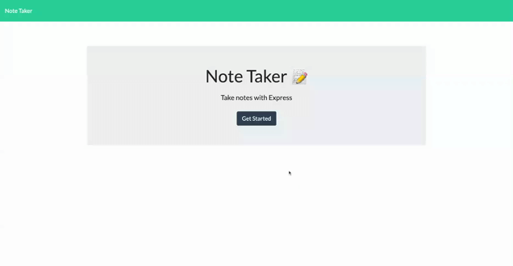

# Friendly_Reminder
[](https://perso.crans.org/) 

Friendly_Reminder is a Note Taker web app that lets users create their own notes. The user can delete old notes and add new ones without having to worry of losing them when you logout of the application. This app runs with Node Express.js and it is deployed with Heroku.

[Create and save your own notes today!](https://no-te-tak-r.herokuapp.com/)

## Table of Contents

- [Installation](#installation)
- [Usage and Testing](#usage-and-test)
- [Video Demo](#video-demo)
- [License](#license)
- [Contact me](#contact)

## Installation

In the console under the file that package.json is:
```
npm init
```
```
npm i express
```
```
npm i uuid
```

## Usage and Test

**After the _npm_ has been installed:** 
```
npm start
```

Or:
```
node server.js
```
Now listening http://localhost:3001

## Video Demo



## License

[](https://opensource.org/licenses/MIT)

## Contact Me
- Github: [JBlay10](https://github.com/JBlay10)
- Email: joseblay10@gmail.com


